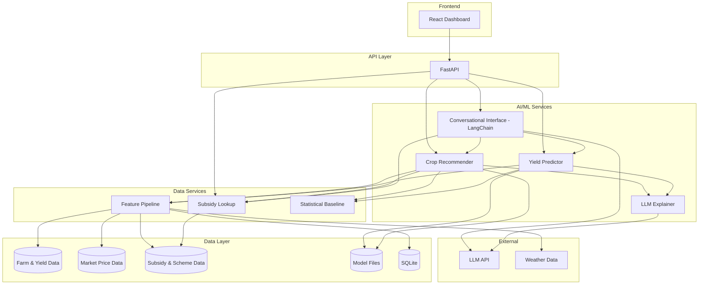
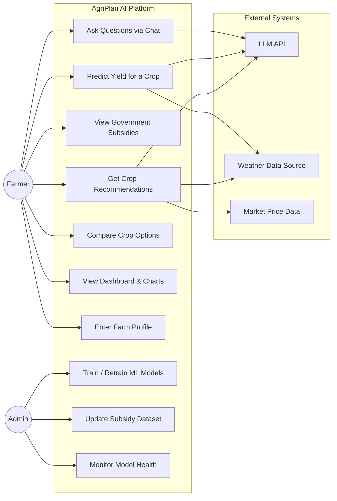
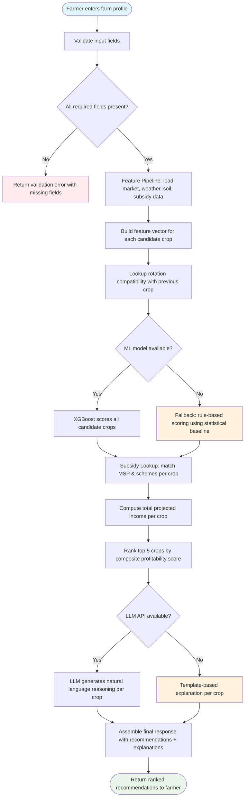
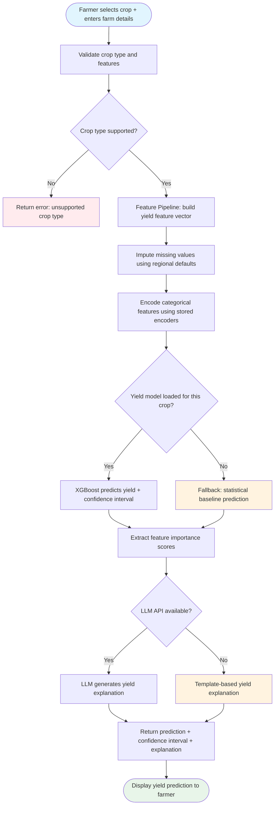
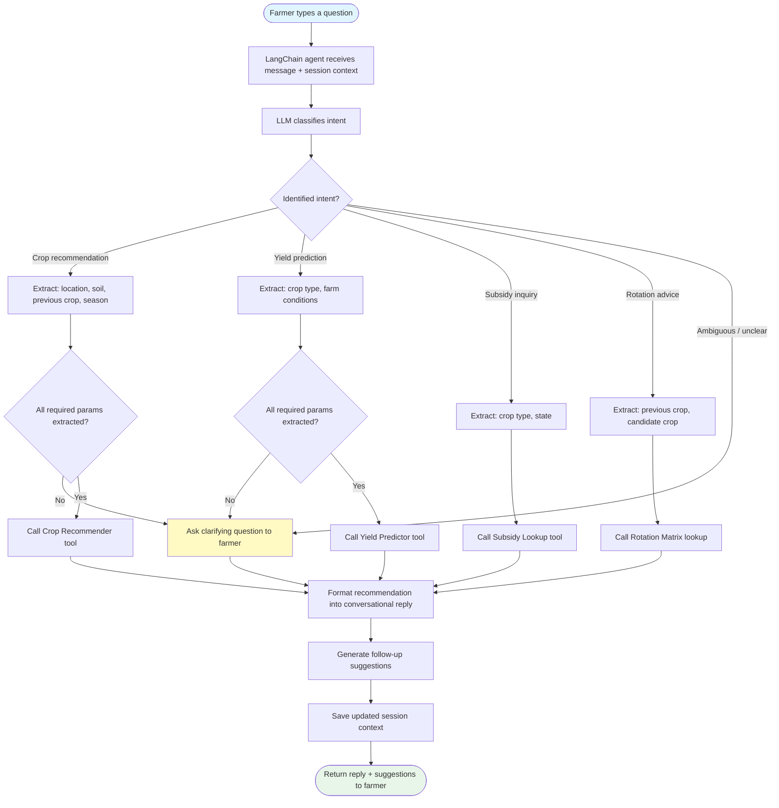
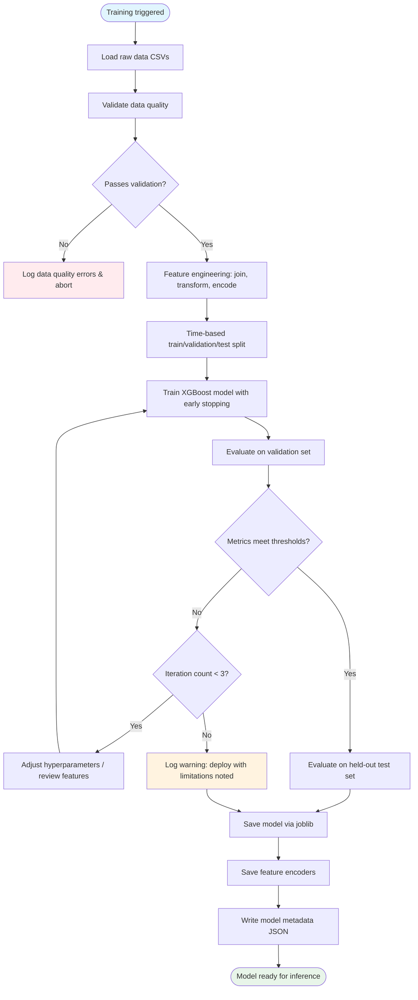
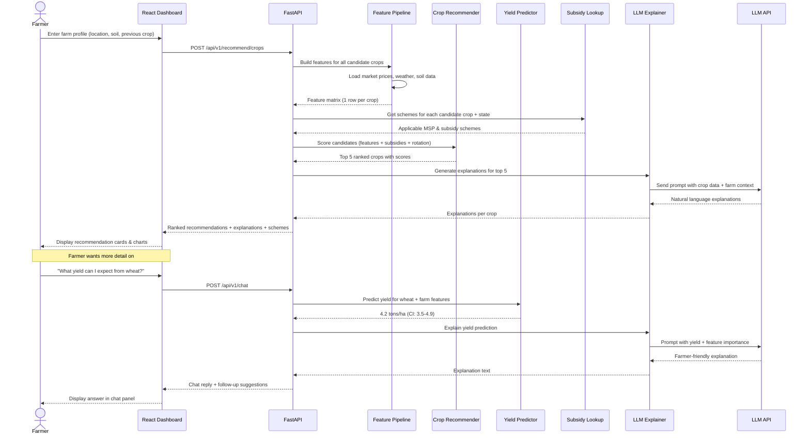
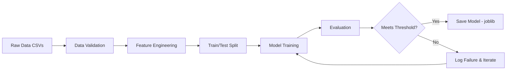

# Design Document: AgriPlan AI — Intelligent Crop Planning Platform

## Overview

AgriPlan AI is a decision-support platform that helps farmers choose their next crop by analyzing multiple real-world factors through different AI technologies:

- **ML Models** (XGBoost / Scikit-learn): Yield prediction and multi-factor crop scoring — combining land conditions, market prices, subsidies, weather, crop rotation history, locality, and demand
- **LLM** (Anthropic Claude API): Natural language explanations that translate ML outputs into farmer-friendly advice, incorporating subsidy details and local context
- **Conversational AI** (LangChain): Natural language query interface so farmers can ask questions like "What should I grow after rice?" or "Which crops have MSP this season?"

The platform targets Indian agriculture as its primary context (MSP, PMFBY, state schemes) but is designed to be extensible to other regions.

### Key Design Principles

1. **Multi-Factor Decisions**: Crop recommendations are never based on a single factor — they weigh land, market, subsidies, weather, rotation, and demand together
2. **Different AI for Different Jobs**: ML for numerical prediction/scoring, LLM for explanation/conversation — each technology where it's strongest
3. **Always Useful**: Every AI component has a non-AI fallback, so the system always returns results
4. **Modular**: Clean interfaces between components so the team can work in parallel
5. **Farmer-First**: All outputs are in simple, actionable language — no technical jargon exposed to users

## Architecture

### High-Level Architecture



### Use Case Diagram



**Actor descriptions:**

| Actor      | Role                                                                 |
| ---------- | -------------------------------------------------------------------- |
| **Farmer** | Primary user — enters farm details, receives recommendations, chats  |
| **Admin**  | Maintains system — retrains models, updates subsidy data, monitors health |

### Process Flow: Crop Recommendation

The core flow from farm profile input to ranked crop recommendations with explanations.



### Process Flow: Yield Prediction

Predicting crop yield for a specific crop on the farmer's land.



### Process Flow: Conversational Query

How the chat interface routes natural language questions to backend services.



### Process Flow: Model Training Pipeline

Offline process for training and validating ML models.



### End-to-End System Flow

Complete flow showing how all components interact for a typical farmer session.



## Decision Factors & How They're Used

| Factor                                             | Source                                      | Used By                           | How                                                                |
| -------------------------------------------------- | ------------------------------------------- | --------------------------------- | ------------------------------------------------------------------ |
| **Land conditions** (soil type, pH, quality)       | Farm profile input                          | Crop Recommender, Yield Predictor | Feature input — crops scored on soil suitability                   |
| **Previous crop**                                  | Farm profile input                          | Crop Recommender                  | Rotation matrix — penalizes bad sequences, boosts beneficial ones  |
| **Market prices**                                  | Government open data / CSV                  | Crop Recommender                  | Revenue estimation — current mandi rates per crop                  |
| **Government subsidies**                           | Curated dataset (MSP, PMFBY, state schemes) | Crop Recommender, Subsidy Lookup  | Revenue boost — MSP-backed crops get score uplift                  |
| **Weather**                                        | Historical data + seasonal forecast         | Yield Predictor, Crop Recommender | Risk factor — drought/flood risk affects yield and suitability     |
| **Locality** (state, district, agro-climatic zone) | Farm profile input                          | All models                        | Region-specific crop suitability, local yields, applicable schemes |
| **Demand**                                         | Regional demand indicators / CSV            | Crop Recommender                  | Market opportunity — high-demand crops scored higher               |

## Data Schemas

### Farm Profile (Input)

| Field                | Type    | Required | Description                                         | Example       |
| -------------------- | ------- | -------- | --------------------------------------------------- | ------------- |
| state                | string  | Yes      | Indian state                                        | "Maharashtra" |
| district             | string  | Yes      | District within state                               | "Pune"        |
| acreage              | float   | Yes      | Available land in hectares                          | 5.0           |
| soil_type            | string  | Yes      | Soil classification                                 | "black"       |
| soil_ph              | float   | No       | Soil pH level (4.0–9.0)                             | 7.2           |
| soil_quality_score   | float   | No       | Composite soil quality (0–1)                        | 0.78          |
| previous_crop        | string  | Yes      | Last crop grown on this land                        | "rice"        |
| irrigation_available | boolean | Yes      | Whether irrigation infrastructure exists            | true          |
| season               | string  | Yes      | Target planting season: "kharif", "rabi", or "zaid" | "rabi"        |

**Valid soil types**: alluvial, black, red, laterite, desert, mountain, peaty

### Crop Recommendation (Output)

| Field                  | Type        | Description                                     |
| ---------------------- | ----------- | ----------------------------------------------- |
| rank                   | integer     | Position in ranked list (1 = best)              |
| crop_type              | string      | Recommended crop name                           |
| profitability_score    | float (0–1) | Composite score combining all decision factors  |
| estimated_yield        | float       | Predicted yield in tons/hectare                 |
| estimated_revenue      | float       | Market revenue in INR (price × yield × acreage) |
| subsidy_benefit        | float       | Estimated subsidy/MSP benefit in INR            |
| total_projected_income | float       | estimated_revenue + subsidy_benefit             |
| risk_level             | string      | "low", "medium", or "high"                      |
| rotation_fit           | string      | "good", "neutral", or "poor" (vs previous crop) |
| confidence             | float (0–1) | Model confidence in this recommendation         |
| feature_importance     | dict        | Top factors and their relative weights          |
| reasoning              | string      | LLM-generated farmer-friendly explanation       |
| applicable_schemes     | list        | Matched government subsidy schemes              |

### Yield Prediction (Output)

| Field               | Type           | Description                               |
| ------------------- | -------------- | ----------------------------------------- |
| crop_type           | string         | Crop for which yield is predicted         |
| estimated_yield     | float          | Predicted yield in tons/hectare           |
| confidence_interval | [float, float] | Lower and upper bound (95% interval)      |
| confidence_score    | float (0–1)    | Model confidence                          |
| feature_importance  | dict           | Feature name → relative importance weight |
| explanation         | string         | LLM-generated farmer-friendly explanation |
| method              | string         | "ml" or "statistical_baseline"            |

### Subsidy Scheme

| Field             | Type   | Description                                              |
| ----------------- | ------ | -------------------------------------------------------- |
| scheme_name       | string | Official scheme name (e.g., "MSP Rabi 2025-26", "PMFBY") |
| scheme_type       | string | "msp", "insurance", "input_subsidy", or "incentive"      |
| crop_type         | string | Applicable crop                                          |
| applicable_states | list   | States where scheme applies (empty = all India)          |
| benefit_amount    | float  | Monetary benefit (INR)                                   |
| benefit_type      | string | "per_quintal", "per_hectare", or "percentage"            |
| eligibility_notes | string | Eligibility criteria description                         |
| source_url        | string | Government notification or reference URL                 |

### Chat Response

| Field                 | Type   | Description                                     |
| --------------------- | ------ | ----------------------------------------------- |
| reply                 | string | Natural language response to the farmer         |
| follow_up_suggestions | list   | 2-3 suggested follow-up questions               |
| tools_used            | list   | Backend tools invoked (e.g., "recommend_crops") |
| session_id            | string | Session identifier for conversation continuity  |

### Crop Rotation Matrix

Pre-computed compatibility scores between crop sequences. Values range from -0.5 (very poor rotation) to +0.5 (very beneficial rotation).

| Previous → Next | Rice | Wheat | Cotton | Soybean | Sugarcane |
| --------------- | ---- | ----- | ------ | ------- | --------- |
| **Rice**        | -0.3 | +0.4  | +0.2   | +0.5    | -0.1      |
| **Wheat**       | +0.3 | -0.3  | +0.3   | +0.2    | +0.1      |
| **Cotton**      | +0.2 | +0.3  | -0.4   | +0.3    | +0.1      |
| **Soybean**     | +0.4 | +0.5  | +0.2   | -0.2    | +0.1      |
| **Sugarcane**   | +0.1 | +0.1  | +0.2   | +0.2    | -0.5      |

**Rules**: Same crop back-to-back is always penalized. Legumes (soybean) before cereals (wheat) is always boosted due to nitrogen fixation.

## Dataset Schemas

### crop_yields_india.csv

Historical crop yield data aggregated by state, district, and year.

| Column            | Type    | Description               | Example       |
| ----------------- | ------- | ------------------------- | ------------- |
| state             | string  | State name                | "Maharashtra" |
| district          | string  | District name             | "Pune"        |
| crop_type         | string  | Crop name                 | "wheat"       |
| year              | integer | Crop year                 | 2024          |
| season            | string  | kharif / rabi / zaid      | "rabi"        |
| area_hectares     | float   | Area under cultivation    | 15000.0       |
| yield_tons_per_ha | float   | Yield in tons per hectare | 3.8           |
| production_tons   | float   | Total production in tons  | 57000.0       |

**Source**: data.gov.in / Ministry of Agriculture open datasets

### market_prices.csv

Current and historical mandi (market) prices for agricultural commodities.

| Column          | Type   | Description                   | Example       |
| --------------- | ------ | ----------------------------- | ------------- |
| crop_type       | string | Commodity name                | "wheat"       |
| state           | string | State                         | "Maharashtra" |
| market_name     | string | Mandi name                    | "Pune"        |
| date            | date   | Price date                    | "2026-02-01"  |
| min_price_inr   | float  | Minimum price (INR/quintal)   | 2100.0        |
| max_price_inr   | float  | Maximum price (INR/quintal)   | 2450.0        |
| modal_price_inr | float  | Most common transaction price | 2300.0        |

**Source**: agmarknet.gov.in / eNAM portal

### subsidies.csv

Government agricultural schemes, MSP rates, and incentive programs.

| Column            | Type   | Description                                 | Example                               |
| ----------------- | ------ | ------------------------------------------- | ------------------------------------- |
| scheme_name       | string | Official scheme name                        | "MSP Rabi 2025-26"                    |
| scheme_type       | string | msp / insurance / input_subsidy / incentive | "msp"                                 |
| crop_type         | string | Applicable crop                             | "wheat"                               |
| applicable_states | string | Comma-separated states or "ALL"             | "ALL"                                 |
| benefit_amount    | float  | Monetary benefit                            | 2275.0                                |
| benefit_type      | string | per_quintal / per_hectare / percentage      | "per_quintal"                         |
| valid_from        | date   | Scheme start date                           | "2025-10-01"                          |
| valid_to          | date   | Scheme end date                             | "2026-03-31"                          |
| eligibility_notes | string | Who qualifies                               | "All farmers via procurement centers" |

### weather_historical.csv

Historical weather data by district for model training.

| Column       | Type    | Description                   | Example       |
| ------------ | ------- | ----------------------------- | ------------- |
| state        | string  | State name                    | "Maharashtra" |
| district     | string  | District name                 | "Pune"        |
| year         | integer | Year                          | 2024          |
| month        | integer | Month (1-12)                  | 6             |
| avg_temp_c   | float   | Average temperature (°C)      | 28.5          |
| min_temp_c   | float   | Minimum temperature (°C)      | 22.0          |
| max_temp_c   | float   | Maximum temperature (°C)      | 35.0          |
| rainfall_mm  | float   | Total rainfall (mm)           | 185.0         |
| humidity_pct | float   | Average relative humidity (%) | 72.0          |

**Source**: IMD (India Meteorological Department) / OpenWeatherMap historical

### soil_data.csv

Soil characteristics by region (district-level).

| Column               | Type   | Description                       | Example                     |
| -------------------- | ------ | --------------------------------- | --------------------------- |
| state                | string | State name                        | "Maharashtra"               |
| district             | string | District name                     | "Pune"                      |
| predominant_soil     | string | Primary soil type                 | "black"                     |
| avg_ph               | float  | Average soil pH                   | 7.2                         |
| organic_carbon_pct   | float  | Organic carbon (%)                | 0.65                        |
| nitrogen_kg_per_ha   | float  | Available nitrogen                | 210.0                       |
| phosphorus_kg_per_ha | float  | Available phosphorus              | 18.5                        |
| potassium_kg_per_ha  | float  | Available potassium               | 320.0                       |
| agro_climatic_zone   | string | Agro-climatic zone classification | "Western Plateau and Hills" |

## Components

### 1. Crop Recommender

**Purpose**: Rank crops by a composite score combining yield potential, market revenue, subsidy benefits, rotation suitability, and risk.

**Technology**: XGBoost (primary), Scikit-learn (fallback)

**Why ML here**: The interactions between factors are non-linear (e.g., a crop might be profitable only if subsidized AND in the right climate zone). Gradient boosting captures these interactions better than hand-written rules.

**Inputs**: FarmProfile + market data + subsidy data + weather data
**Outputs**: Ranked list of CropRecommendation objects

**Feature vector for crop scoring:**

| Feature                | Type        | Description                                                   |
| ---------------------- | ----------- | ------------------------------------------------------------- |
| soil_type_encoded      | categorical | One-hot encoded soil type                                     |
| soil_ph                | float       | Soil pH level                                                 |
| soil_quality_score     | float       | Composite soil quality (0-1)                                  |
| acreage                | float       | Available land in hectares                                    |
| previous_crop_encoded  | categorical | Last crop grown (for rotation)                                |
| rotation_compatibility | float       | Pre-computed rotation score for this crop after previous crop |
| market_price_current   | float       | Current mandi rate (INR/quintal)                              |
| market_price_trend     | float       | 30-day price trend (+/-)                                      |
| msp_available          | binary      | Whether MSP is declared for this crop                         |
| msp_rate               | float       | MSP rate if available, else 0                                 |
| subsidy_score          | float       | Composite subsidy benefit score (0-1)                         |
| avg_temperature        | float       | Seasonal avg temperature for locality                         |
| expected_rainfall      | float       | Seasonal expected rainfall (mm)                               |
| agro_climatic_zone     | categorical | Encoded zone classification                                   |
| state_encoded          | categorical | State identifier                                              |
| demand_index           | float       | Regional demand indicator (0-1)                               |
| historical_yield_avg   | float       | Regional avg yield for this crop                              |

**Evaluation metrics**: NDCG@5, Precision@5, MAP

### 2. Yield Predictor

**Purpose**: Predict per-crop yield for a specific farm profile and conditions.

**Technology**: XGBoost (one model per crop type)

**Why ML here**: Yield depends on complex interactions between soil, weather, and farming practices that statistical averages miss.

**Inputs**: crop_type + farm/environmental features
**Outputs**: YieldPrediction with confidence interval

**Feature vector for yield prediction:**

| Feature              | Type        | Description                           |
| -------------------- | ----------- | ------------------------------------- |
| soil_quality_score   | float       | Composite soil quality (0-1)          |
| soil_ph              | float       | Soil pH level                         |
| avg_temperature      | float       | Seasonal avg temperature (°C)         |
| total_precipitation  | float       | Seasonal total rainfall (mm)          |
| humidity             | float       | Average humidity (%)                  |
| planting_month       | integer     | Month of planting (1-12)              |
| historical_yield_avg | float       | 3-year avg yield for this region/crop |
| fertilizer_amount    | float       | Fertilizer applied (kg/hectare)       |
| irrigation_available | binary      | Whether irrigation is available       |
| agro_climatic_zone   | categorical | Encoded agro-climatic zone            |

**Evaluation metrics**: RMSE, MAE, R² score

### 3. Subsidy Lookup

**Purpose**: Match applicable government schemes to a crop/region combination.

**Technology**: Simple data service (pandas filtering on curated CSV)

**Why not ML**: Subsidy rules are deterministic — a crop either has MSP or it doesn't. No prediction needed.

**Inputs**: crop_type + state
**Outputs**: List of SubsidyScheme objects + estimated total benefit in INR

### 4. LLM Explainer

**Purpose**: Turn ML outputs + subsidy data into farmer-friendly explanations.

**Technology**: Anthropic Claude API

**Why LLM here**: Generating natural, contextual explanations that weave together yield data, market conditions, subsidy info, and rotation advice requires language understanding that templates alone can't match.

**Inputs**: Prediction/recommendation data + farm profile context
**Outputs**: Natural language explanation string (100-150 words)
**Fallback**: Template-based explanation when Claude API is unavailable

**Prompt template** (stored in `prompts/crop_recommendation.txt`):

```
You are an agricultural advisor helping an Indian farmer decide what to grow next season.
Speak simply and clearly. Avoid technical jargon. Use INR for money.

Farm Details:
- Location: {state}, {district}
- Land: {acreage} hectares, {soil_type} soil (pH {soil_ph})
- Previous crop: {previous_crop}
- Season: {season}

Recommended Crop: {crop_type}
- Expected yield: {yield} tons/hectare
- Market price: ₹{market_price}/quintal
- Estimated revenue: ₹{revenue}
- Government support: {subsidy_details}
- Rotation fit: {rotation_fit} after {previous_crop}

Top factors driving this recommendation:
{feature_importance}

Explain in 100-150 words:
1. Why this crop is a good choice for this farmer's specific situation
2. How government subsidies/MSP benefit them
3. One practical tip for getting the best yield
```

### 5. Conversational Interface

**Purpose**: Let farmers ask questions naturally instead of filling forms.

**Technology**: LangChain with Claude backend

**Inputs**: Natural language message + session_id
**Outputs**: ChatResponse with reply, follow-up suggestions, and tools used

**Registered tools:**

| Tool Name          | Maps To                           | Example Query                            |
| ------------------ | --------------------------------- | ---------------------------------------- |
| `recommend_crops`  | CropRecommender.recommend         | "What should I grow next season?"        |
| `predict_yield`    | YieldPredictor.predict            | "How much wheat can I grow per hectare?" |
| `lookup_subsidies` | SubsidyLookup.get_schemes         | "Which crops have MSP this year?"        |
| `check_rotation`   | CropRecommender (rotation matrix) | "Is it good to grow wheat after rice?"   |

**Session context**: In-memory dict keyed by session_id. Stores extracted farm profile so farmers don't have to repeat information across turns.

### 6. Feature Pipeline

**Purpose**: Combine data from all sources into model-ready features.

**Inputs**: FarmProfile + candidate crop list
**Outputs**: Feature DataFrame (one row per candidate crop for recommendation, one row for yield prediction)

**Responsibilities:**

- Load and join data from CSVs (yields, prices, weather, soil, subsidies)
- Handle missing values using regional defaults or mean imputation
- Encode categorical features (soil type, state, crop type) consistently between training and inference
- Compute derived features (rotation_compatibility from matrix, subsidy_score from schemes, market_price_trend from price history)
- Validate feature schema before passing to models

### 7. Statistical Baseline (existing — fallback)

Existing SciPy optimization and NumPy Monte Carlo methods serve as the fallback layer. The new ML components wrap these — if the ML model fails to load or predict, the system automatically delegates to the baseline and marks the response with `method: "statistical_baseline"`.

## Model Training Process

### Training Pipeline Overview



### Step 1: Data Collection & Validation

**Data sources:**

- `crop_yields_india.csv` — Historical yields from data.gov.in (minimum 5 years, 10+ states)
- `market_prices.csv` — Mandi prices from agmarknet.gov.in
- `weather_historical.csv` — IMD weather records
- `soil_data.csv` — Soil survey data by district
- `subsidies.csv` — Curated from government notifications

**Validation checks before training:**

- No more than 20% missing values in any critical column
- Yield values within physically plausible ranges (0–30 tons/hectare depending on crop)
- Price values > 0
- All required columns present in each CSV
- No duplicate rows (same state + district + crop + year)
- At least 500 rows per crop type for yield model training

### Step 2: Feature Engineering

**For Yield Predictor (per crop):**

1. Join yield data with weather data on (state, district, year)
2. Join with soil data on (state, district)
3. Compute seasonal weather aggregates (avg temp, total rainfall for growing season)
4. Impute missing soil_ph and soil_quality with district-level or state-level averages
5. Encode agro_climatic_zone using label encoding (consistent mapping stored as JSON)
6. Final feature matrix: one row per (state, district, year) observation

**For Crop Recommender:**

1. Start with yield data joined with market prices for the same crop and year
2. Compute profitability label: `yield × modal_price_inr` as target variable
3. Join with soil, weather, and subsidy data
4. Add rotation_compatibility score from rotation matrix (previous crop → current crop)
5. Compute demand_index from production trends (3-year change in district area under crop)
6. Encode categorical features (soil_type, state, crop_type) — store encoders for inference reuse
7. Final feature matrix: one row per (state, district, crop, year) combination

### Step 3: Train/Test Split

| Split      | Percentage | Strategy                                                |
| ---------- | ---------- | ------------------------------------------------------- |
| Training   | 70%        | Earlier years (e.g., 2018–2022)                         |
| Validation | 15%        | Next year (e.g., 2023) — used for hyperparameter tuning |
| Test       | 15%        | Most recent year (e.g., 2024) — held out for final eval |

**Important**: Split by time (year), not randomly, to prevent data leakage. A model trained on 2023 data should not be validated on 2022 data.

### Step 4: Model Training

**Yield Predictor** (one model per crop):

| Parameter        | Value                        | Notes                                     |
| ---------------- | ---------------------------- | ----------------------------------------- |
| Algorithm        | XGBRegressor                 | Gradient boosting for regression          |
| n_estimators     | 200                          | Number of boosting rounds                 |
| max_depth        | 6                            | Tree depth (prevent overfitting)          |
| learning_rate    | 0.1                          | Step size shrinkage                       |
| subsample        | 0.8                          | Row sampling per tree                     |
| colsample_bytree | 0.8                          | Feature sampling per tree                 |
| early_stopping   | 20 rounds                    | Stop if validation metric doesn't improve |
| cross-validation | 5-fold (within training set) | For hyperparameter selection              |

**Crop Recommender** (single model, all crops):

| Parameter        | Value        | Notes                                         |
| ---------------- | ------------ | --------------------------------------------- |
| Algorithm        | XGBRegressor | Predicts profitability score                  |
| n_estimators     | 300          | More trees for multi-crop complexity          |
| max_depth        | 8            | Slightly deeper for more feature interactions |
| learning_rate    | 0.05         | Slower learning for better generalization     |
| subsample        | 0.8          | Row sampling                                  |
| colsample_bytree | 0.7          | Feature sampling                              |
| early_stopping   | 30 rounds    | Patience for convergence                      |
| cross-validation | 5-fold       | For hyperparameter selection                  |

### Step 5: Evaluation

**Yield Predictor — Minimum thresholds to pass:**

| Metric | Threshold | Description                            |
| ------ | --------- | -------------------------------------- |
| RMSE   | < 1.5     | Root mean squared error (tons/hectare) |
| MAE    | < 1.0     | Mean absolute error (tons/hectare)     |
| R²     | > 0.60    | Variance explained (higher is better)  |

**Crop Recommender — Minimum thresholds to pass:**

| Metric      | Threshold | Description                                   |
| ----------- | --------- | --------------------------------------------- |
| NDCG@5      | > 0.70    | Ranking quality of top 5 recommendations      |
| Precision@5 | > 0.60    | Proportion of top 5 that are truly profitable |
| Spearman ρ  | > 0.50    | Rank correlation with actual profitability    |

**If thresholds are not met:**

1. Review feature importance — check if key features (soil, weather, price) are contributing
2. Check for data quality issues (leakage, missing values, class imbalance)
3. Adjust hyperparameters (reduce max_depth if overfitting, increase n_estimators if underfitting)
4. Consider adding/removing features
5. If still failing after 3 iterations, deploy with a note about model limitations and rely more on fallback

### Step 6: Model Serialization & Storage

- Trained models saved using `joblib.dump()` to `models/` directory
- **Naming convention**: `yield_{crop_type}.joblib`, `crop_recommender.joblib`
- Feature encoders (label encoders, one-hot mappings) saved alongside: `encoders_{model_name}.joblib`
- Model metadata saved as JSON alongside each model:

**Model metadata file** (`models/yield_wheat_metadata.json`):

```json
{
  "model_name": "yield_wheat",
  "model_type": "XGBRegressor",
  "crop_type": "wheat",
  "trained_on": "2026-02-10",
  "training_data_rows": 4200,
  "training_data_years": "2018-2024",
  "features": ["soil_quality_score", "soil_ph", "avg_temperature", "..."],
  "metrics": {
    "rmse": 1.12,
    "mae": 0.85,
    "r2": 0.72
  },
  "hyperparameters": {
    "n_estimators": 200,
    "max_depth": 6,
    "learning_rate": 0.1
  }
}
```

### Training Workflow for Each Model

**Yield Predictor** (repeat for each crop: rice, wheat, cotton, sugarcane, soybean):

1. Filter `crop_yields_india.csv` to crop type
2. Join with weather + soil data
3. Run feature engineering
4. Time-based train/val/test split
5. Train XGBRegressor with early stopping on validation set
6. Evaluate on test set
7. If metrics pass → save model + encoders + metadata
8. Log training results to `notebooks/03_model_training.ipynb`

**Crop Recommender** (single model):

1. Combine all crops from yield data
2. Join with market prices to compute profitability target
3. Join with soil + weather + subsidy + rotation data
4. Run feature engineering
5. Time-based split
6. Train XGBRegressor
7. Evaluate ranking metrics (NDCG@5, Precision@5)
8. If metrics pass → save model + encoders + metadata

## API Endpoints

### POST /api/v1/recommend/crops

**Request:**

```json
{
  "farm_profile": {
    "state": "Maharashtra",
    "district": "Pune",
    "acreage": 5.0,
    "soil_type": "black",
    "soil_ph": 7.2,
    "previous_crop": "rice",
    "irrigation_available": true,
    "season": "rabi"
  }
}
```

**Response:**

```json
{
  "recommendations": [
    {
      "rank": 1,
      "crop_type": "wheat",
      "profitability_score": 0.89,
      "estimated_yield": 4.2,
      "estimated_revenue": 126000,
      "subsidy_benefit": 15000,
      "total_projected_income": 141000,
      "risk_level": "low",
      "rotation_fit": "good",
      "confidence": 0.84,
      "reasoning": "Wheat is an excellent rabi choice after rice on your black soil in Pune. The current MSP of ₹2,275/quintal guarantees a good price, and wheat thrives in your soil pH of 7.2...",
      "applicable_schemes": [
        {
          "scheme_name": "MSP Rabi 2025-26",
          "benefit": "₹2,275/quintal guaranteed"
        },
        {
          "scheme_name": "PMFBY",
          "benefit": "Crop insurance at 1.5% premium"
        }
      ],
      "feature_importance": {
        "rotation_compatibility": 0.22,
        "msp_available": 0.18,
        "soil_quality_score": 0.16,
        "market_price_trend": 0.14,
        "weather_suitability": 0.12
      }
    }
  ],
  "method": "ml"
}
```

### POST /api/v1/predict/yield

**Request:**

```json
{
  "crop_type": "wheat",
  "features": {
    "state": "Maharashtra",
    "soil_quality_score": 0.78,
    "soil_ph": 7.2,
    "avg_temperature": 22.5,
    "expected_rainfall": 120.0,
    "irrigation_available": true,
    "planting_month": 11,
    "fertilizer_amount": 150.0
  }
}
```

**Response:**

```json
{
  "crop_type": "wheat",
  "estimated_yield": 4.2,
  "confidence_interval": [3.5, 4.9],
  "confidence_score": 0.84,
  "explanation": "Your black soil with pH 7.2 is well-suited for wheat. With irrigation available and good fertilizer application, you can expect around 4.2 tons per hectare...",
  "feature_importance": {
    "soil_quality_score": 0.3,
    "irrigation_available": 0.22,
    "avg_temperature": 0.18,
    "fertilizer_amount": 0.15,
    "expected_rainfall": 0.1
  },
  "method": "ml"
}
```

### GET /api/v1/subsidies?crop=wheat&state=Maharashtra

**Response:**

```json
{
  "crop_type": "wheat",
  "state": "Maharashtra",
  "schemes": [
    {
      "scheme_name": "MSP Rabi 2025-26",
      "scheme_type": "msp",
      "benefit_amount": 2275,
      "benefit_type": "per_quintal",
      "eligibility_notes": "All wheat farmers selling through designated procurement centers"
    },
    {
      "scheme_name": "PMFBY",
      "scheme_type": "insurance",
      "benefit_amount": 1.5,
      "benefit_type": "percentage",
      "eligibility_notes": "Premium of 1.5% for rabi crops; covers natural calamities"
    }
  ]
}
```

### POST /api/v1/chat

**Request:**

```json
{
  "message": "I grew rice last kharif in Pune. What should I grow this rabi?",
  "session_id": "farmer_001"
}
```

**Response:**

```json
{
  "reply": "Great question! After rice in Pune, wheat is your best rabi option. Here's why:\n\n1. **Rotation benefit**: Wheat after rice is one of the best rotation pairs — rice enriches the soil with organic matter that wheat loves.\n2. **MSP guarantee**: Wheat has MSP of ₹2,275/quintal this season, so your price is protected.\n3. **Your soil**: Black soil with good pH is ideal for wheat.\n\nYou can expect around 4.2 tons/hectare, which translates to roughly ₹1.4 lakhs income on your 5 hectares.\n\nWant me to compare this with other rabi options like chickpea or mustard?",
  "follow_up_suggestions": [
    "How does chickpea compare?",
    "What subsidies are available for wheat?",
    "What yield can I expect?"
  ],
  "tools_used": ["recommend_crops", "lookup_subsidies"]
}
```

## Error Handling

### Fallback Chain

| Component                | Primary         | Fallback                                |
| ------------------------ | --------------- | --------------------------------------- |
| Crop Recommender         | XGBoost model   | Rule-based ranking (existing)           |
| Yield Predictor          | XGBoost model   | Statistical baseline (existing)         |
| LLM Explainer            | LLM API         | Template-based explanation              |
| Conversational Interface | LangChain + LLM | Structured error message                |
| Subsidy Lookup           | CSV dataset     | Empty list with "data unavailable" note |

### Error Response Format

```json
{
  "error": {
    "code": "MODEL_NOT_FOUND",
    "message": "No trained model found for crop type 'quinoa'",
    "fallback_used": true,
    "fallback_method": "statistical_baseline"
  }
}
```

## Testing Strategy

**Unit Tests (pytest):**

1. Feature pipeline produces correct output shapes and handles missing values
2. Yield predictor returns valid predictions (positive values, valid confidence intervals)
3. Crop recommender returns results sorted by profitability score
4. Subsidy lookup returns correct schemes for crop + state combinations
5. Rotation matrix applies correct penalties/boosts
6. LLM explainer template fallback works when API is unavailable
7. API endpoints return correct HTTP status codes and response schemas

**Integration Tests:**

1. End-to-end: API request → feature pipeline → ML prediction → subsidy enrichment → LLM explanation → response
2. Fallback: ML unavailable → statistical baseline returns valid results
3. Chat: Natural language query → intent classification → correct tool invoked → formatted response

## Project Structure

```
AgriPlan-AI/
├── app/
│   ├── __init__.py
│   ├── main.py                    # FastAPI entry point
│   ├── api/
│   │   ├── __init__.py
│   │   ├── routes_recommend.py    # /recommend/crops
│   │   ├── routes_predict.py      # /predict/yield
│   │   ├── routes_chat.py         # /chat
│   │   └── routes_subsidies.py    # /subsidies
│   ├── ml/
│   │   ├── __init__.py
│   │   ├── crop_recommender.py    # CropRecommender
│   │   ├── yield_predictor.py     # YieldPredictor
│   │   └── feature_pipeline.py    # FeaturePipeline
│   ├── llm/
│   │   ├── __init__.py
│   │   ├── explainer.py           # LLMExplainer
│   │   └── conversational.py      # ConversationalInterface
│   ├── data/
│   │   ├── __init__.py
│   │   └── subsidy_lookup.py      # SubsidyLookup
│   ├── baseline/
│   │   └── statistical.py         # Existing statistical methods (wrapper)
│   └── models.py                  # Pydantic models / dataclasses
├── prompts/
│   ├── crop_recommendation.txt
│   ├── yield_explanation.txt
│   ├── chat_system_prompt.txt
│   └── subsidy_summary.txt
├── data/
│   ├── crop_yields_india.csv      # Historical yield data by state/crop
│   ├── market_prices.csv          # Mandi price data
│   ├── subsidies.csv              # Government schemes & MSP rates
│   ├── soil_data.csv              # Soil characteristics by region
│   ├── weather_historical.csv     # Historical weather by district
│   └── rotation_matrix.csv        # Crop rotation compatibility
├── models/                        # Serialized model files
│   ├── yield_rice.joblib
│   ├── yield_wheat.joblib
│   ├── yield_cotton.joblib
│   ├── yield_sugarcane.joblib
│   ├── yield_soybean.joblib
│   ├── crop_recommender.joblib
│   └── *_metadata.json            # Model metadata files
├── notebooks/
│   ├── 01_data_exploration.ipynb
│   ├── 02_feature_engineering.ipynb
│   └── 03_model_training.ipynb
├── tests/
│   ├── test_crop_recommender.py
│   ├── test_yield_predictor.py
│   ├── test_subsidy_lookup.py
│   ├── test_explainer.py
│   └── test_api.py
├── frontend/
│   └── app.py                     # Streamlit dashboard
├── .env.example
├── requirements.txt
├── Dockerfile
├── docker-compose.yml
└── README.md
```

## Workstream Breakdown

### Dev 1: ML — Yield Predictor + Training Pipeline

- Source and explore Indian crop yield datasets
- Feature engineering for yield prediction
- Train XGBoost yield models per crop (rice, wheat, cotton, sugarcane, soybean)
- Implement YieldPredictor with predict/train/fallback
- Write unit tests

### Dev 2: ML — Crop Recommender + Feature Pipeline

- Implement FeaturePipeline combining all data sources
- Build crop rotation matrix
- Train multi-factor crop recommendation model
- Implement CropRecommender with subsidy integration
- Implement SubsidyLookup service
- Write unit tests

### Dev 3: LLM + Conversational Interface

- Set up LLM SDK integration
- Write and iterate on prompt templates for crop/yield explanations
- Implement LLMExplainer with template fallback
- Implement ConversationalInterface with LangChain
- Register all tools in LangChain agent
- Curate subsidy/scheme dataset
- Write tests with mocked LLM responses

### Dev 4: API + Frontend + Integration

- Set up FastAPI project structure and all endpoints
- Build Streamlit dashboard (farm profile form, recommendation cards, yield charts, chat panel)
- Docker setup
- Integration testing across all components
- Documentation and README
