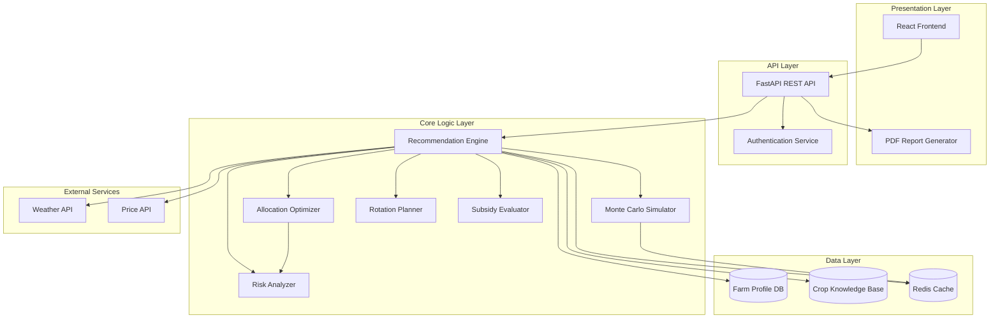

# Design Document: AgriPlan AI

## Overview

AgriPlan AI is an intelligent agricultural decision support platform that helps farmers optimize crop selection through constrained optimization under uncertainty. The system balances expected profit maximization with risk mitigation while respecting real-world constraints (equipment, soil, rotation, harvest timing).

This design targets a hackathon MVP (2-3 weeks, 4-person team) focusing on core recommendation logic, Monte Carlo simulation, and acreage allocation optimization. The architecture prioritizes modularity to enable rapid iteration and future extensibility.

### Key Design Principles

1. **Separation of Concerns**: Clear boundaries between data ingestion, optimization logic, and presentation
2. **Probabilistic Reasoning**: Monte Carlo simulation for profit uncertainty quantification
3. **Constraint-Based Optimization**: Explicit modeling of equipment, soil, rotation, and harvest constraints
4. **Explainability**: Transparent factor attribution for all recommendations
5. **MVP-First**: Focus on single-season optimization with optional next-season planning

### Technology Stack

- **Backend**: Python 3.11+ (FastAPI for API layer)
- **Optimization**: SciPy for constrained optimization, NumPy for Monte Carlo simulation
- **Data Storage**: PostgreSQL for farm profiles, Redis for caching weather/price data
- **External APIs**: OpenWeatherMap (weather), Alpha Vantage or similar (commodity prices)
- **Frontend**: React with Recharts for visualization
- **Deployment**: Docker containers, AWS Lambda for serverless functions

## Architecture

### High-Level Architecture



### Component Responsibilities

**Recommendation Engine**: Orchestrates the entire recommendation pipeline, coordinates all sub-components, applies constraints, ranks crops by profit score with risk tiebreaker.

**Monte Carlo Simulator**: Performs probabilistic profit simulation by varying yield and price within historical variance ranges, computes expected profit and percentile scenarios.

**Allocation Optimizer**: Solves constrained optimization problem to allocate acreage among top crops, balancing profit maximization with risk reduction and equipment constraints.

**Risk Analyzer**: Computes risk scores based on rainfall variability and price volatility, provides risk mitigation recommendations for high-risk crops.

**Rotation Planner**: Evaluates crop rotation compatibility, prevents consecutive planting of same crop family, tracks soil health index changes.

**Subsidy Evaluator**: Determines government subsidy eligibility using configuration-based rules, computes estimated subsidy amounts.

## Components and Interfaces

### 1. Farm Profile Manager

**Purpose**: Manages farm profile data including location, acreage, soil type, equipment, and crop history.

**Interface**:
```python
class FarmProfile:
    farm_id: str
    location: GeoLocation
    total_acreage: float
    soil_type: SoilType
    equipment: List[Equipment]
    crop_history: List[CropRecord]
    
class FarmProfileManager:
    def create_profile(profile: FarmProfile) -> str
    def update_profile(farm_id: str, updates: Dict) -> FarmProfile
    def get_profile(farm_id: str) -> FarmProfile
    def validate_profile(profile: FarmProfile) -> ValidationResult
```

**Validation Rules**:
- Total acreage: 1-10,000 acres
- Location: Valid lat/lon coordinates
- Soil type: Enum from predefined list
- Equipment: Non-empty list with valid equipment types
- Crop history: At least 1 year of data preferred

**Addresses Requirements**: 1.1, 1.2, 1.3, 1.4, 1.5

---

### 2. Weather Data Integration Module

**Purpose**: Retrieves and caches weather forecast and historical climate data for farm locations.

**Interface**:
```python
class WeatherData:
    location: GeoLocation
    forecast: List[DailyForecast]  # 14-day forecast
    historical: List[YearlyClimate]  # 3+ years
    rainfall_variance: float
    
class WeatherIntegration:
    def fetch_weather_data(location: GeoLocation) -> WeatherData
    def get_rainfall_variance(location: GeoLocation, years: int) -> float
    def detect_climate_anomalies(location: GeoLocation) -> List[Anomaly]
```

**Data Sources**:
- Primary: OpenWeatherMap API (free tier: 1000 calls/day)
- Fallback: Regional averages from NOAA historical data
- Cache TTL: 24 hours for forecasts, 30 days for historical data

**Addresses Requirements**: 2.1, 2.2, 2.3, 2.4, 2.5

---

### 3. Market Price Data Integration Module

**Purpose**: Retrieves and caches commodity price data and forecasts.

**Interface**:
```python
class PriceData:
    crop: CropType
    current_price: float
    historical_prices: List[PricePoint]  # 3+ years
    forecast_price: float  # Harvest season estimate
    price_volatility: float
    
class PriceIntegration:
    def fetch_price_data(crop: CropType) -> PriceData
    def forecast_harvest_price(crop: CropType, harvest_date: Date) -> float
    def compute_price_volatility(crop: CropType, years: int) -> float
```

**Forecasting Method**:
- Simple moving average (3-month window) for MVP
- Future: ARIMA or ML-based forecasting

**Data Sources**:
- Primary: USDA NASS API (free, updated weekly)
- Fallback: Conservative estimates from historical averages
- Cache TTL: 7 days

**Addresses Requirements**: 3.1, 3.2, 3.3, 3.4, 3.5

---

### 4. Yield Estimator

**Purpose**: Predicts expected crop yield per acre with confidence intervals.

**Interface**:
```python
class YieldEstimate:
    crop: CropType
    expected_yield: float  # bushels/acre or tons/acre
    confidence_interval: Tuple[float, float]  # (lower, upper)
    variance: float
    
class YieldEstimator:
    def estimate_yield(
        crop: CropType,
        soil: SoilType,
        weather: WeatherData,
        history: List[CropRecord]
    ) -> YieldEstimate
```

**Estimation Logic**:
1. Start with baseline yield for crop + soil combination (from crop knowledge base)
2. Adjust for rainfall deviation from optimal range (-20% to +10%)
3. Adjust for temperature deviation from optimal range (-15% to +5%)
4. Adjust using farm's historical yield if available (+/- 10%)
5. Compute variance from historical weather variability

**Addresses Requirements**: 5.1, 5.2, 5.3, 5.4, 5.5

---

### 5. Profit Calculator

**Purpose**: Computes net profit per acre incorporating all costs and revenues.

**Interface**:
```python
class ProfitProjection:
    crop: CropType
    revenue: float
    costs: CostBreakdown
    subsidies: float
    net_profit: float
    sensitivity_range: Tuple[float, float]
    
class CostBreakdown:
    seed_cost: float
    fertilizer_cost: float
    labor_cost: float
    equipment_cost: float
    
class ProfitCalculator:
    def calculate_profit(
        crop: CropType,
        yield_estimate: YieldEstimate,
        price_data: PriceData,
        subsidies: float
    ) -> ProfitProjection
```

**Cost Estimation**:
- Seed cost: Crop-specific rate from knowledge base
- Fertilizer cost: Soil-dependent, from user input or defaults
- Labor cost: Crop-specific hours × regional wage rate
- Equipment cost: Depreciation + fuel for crop-specific operations

**Addresses Requirements**: 6.1, 6.2, 6.3, 6.4, 6.5

---

### 6. Subsidy Evaluator

**Purpose**: Determines government subsidy eligibility and computes estimated amounts.

**Interface**:
```python
class SubsidyRule:
    program_name: str
    eligible_crops: List[CropType]
    min_acreage: float
    amount_per_acre: float
    conditions: Dict[str, Any]
    
class SubsidyEvaluation:
    eligible_programs: List[str]
    total_subsidy: float
    uncertain_programs: List[str]
    
class SubsidyEvaluator:
    def evaluate_subsidies(
        crop: CropType,
        acreage: float,
        farm_profile: FarmProfile
    ) -> SubsidyEvaluation
    
    def load_subsidy_rules(config_file: str) -> List[SubsidyRule]
```

**Configuration-Based Rules**:
- Rules stored in JSON/YAML configuration files
- MVP includes 3-5 common US federal programs (e.g., ARC, PLC)
- Extensible to state-level programs

**Addresses Requirements**: 7.1, 7.2, 7.3, 7.4, 7.5

---

### 7. Rotation Planner

**Purpose**: Evaluates crop rotation compatibility and generates rotation recommendations.

**Interface**:
```python
class RotationCompatibility:
    crop: CropType
    compatible: bool
    soil_health_impact: float  # -1.0 to +1.0
    reason: str
    
class RotationSequence:
    current_season: CropType
    next_season: Optional[CropType]
    soil_health_index: float
    
class RotationPlanner:
    def evaluate_compatibility(
        crop: CropType,
        crop_history: List[CropRecord]
    ) -> RotationCompatibility
    
    def generate_rotation_sequence(
        current_crop: CropType,
        farm_profile: FarmProfile
    ) -> List[CropType]
    
    def compute_soil_health_index(
        rotation_sequence: List[CropType]
    ) -> float
```

**Rotation Rules**:
- Prevent same crop family in consecutive seasons
- Legumes improve soil health (+0.2 index)
- Repetitive heavy feeders degrade soil health (-0.3 index)
- Soil health index: 0.0 (depleted) to 1.0 (optimal)

**Addresses Requirements**: 8.1, 8.2, 8.3, 8.4, 8.5

---

### 8. Harvest Conflict Detector

**Purpose**: Detects and resolves harvest timing conflicts among crop combinations.

**Interface**:
```python
class HarvestWindow:
    crop: CropType
    start_date: Date
    end_date: Date
    equipment_required: List[Equipment]
    labor_hours: float
    
class HarvestConflict:
    conflicting_crops: List[CropType]
    overlap_period: Tuple[Date, Date]
    resolvable: bool
    resolution_strategy: Optional[str]
    
class HarvestConflictDetector:
    def detect_conflicts(
        crop_combination: List[CropType],
        equipment: List[Equipment]
    ) -> List[HarvestConflict]
    
    def generate_harvest_timeline(
        crops: List[CropType]
    ) -> List[HarvestWindow]
```

**Conflict Resolution**:
- Check if equipment capacity can handle overlapping harvests
- Consider labor availability (assume 10 hours/day per worker)
- If unresolvable, adjust crop recommendations to avoid conflict

**Addresses Requirements**: 9.1, 9.2, 9.3, 9.4, 9.5

---

### 9. Risk Analyzer

**Purpose**: Computes risk scores based on rainfall variability and price volatility.

**Interface**:
```python
class RiskScore:
    crop: CropType
    total_risk: float  # 0-100 scale
    rainfall_risk: float
    price_risk: float
    mitigation_recommendations: List[str]
    
class RiskAnalyzer:
    def compute_risk_score(
        crop: CropType,
        weather_data: WeatherData,
        price_data: PriceData
    ) -> RiskScore
    
    def generate_mitigation_recommendations(
        risk_score: RiskScore
    ) -> List[str]
```

**Risk Scoring Formula**:
```
rainfall_risk = normalize(rainfall_variance, 0, max_variance) * 50
price_risk = normalize(price_volatility, 0, max_volatility) * 50
total_risk = rainfall_risk + price_risk
```

**Mitigation Recommendations** (when risk > 70):
- High rainfall risk: Consider drought-resistant varieties, irrigation
- High price risk: Consider forward contracts, crop insurance

**Addresses Requirements**: 10.1, 10.2, 10.3, 10.4, 10.5

---

### 10. Monte Carlo Simulator

**Purpose**: Performs probabilistic profit simulation to quantify uncertainty.

**Interface**:
```python
class SimulationResult:
    crop: CropType
    iterations: int
    expected_profit: float  # Mean
    percentile_10: float  # Worst-case
    percentile_90: float  # Best-case
    profit_distribution: List[float]
    
class MonteCarloSimulator:
    def simulate_profit(
        crop: CropType,
        yield_estimate: YieldEstimate,
        price_data: PriceData,
        iterations: int = 300
    ) -> SimulationResult
```

**Simulation Logic**:
1. For each iteration (300 minimum):
   - Sample yield from normal distribution (mean=expected_yield, std=variance)
   - Sample price from normal distribution (mean=forecast_price, std=volatility)
   - Compute profit = (yield × price) - costs
2. Aggregate results:
   - Expected profit = mean of all iterations
   - 10th percentile = worst-case scenario
   - 90th percentile = best-case scenario

**Performance Target**: Complete 300 iterations × 3 crops in < 5 seconds

**Addresses Requirements**: 13.1, 13.2, 13.3, 13.4, 13.5, 13.6, 13.7, 13.8

---

### 11. Allocation Optimizer

**Purpose**: Suggests optimal land allocation percentages among top crops.

**Interface**:
```python
class AllocationRecommendation:
    allocations: Dict[CropType, float]  # Crop -> percentage
    expected_portfolio_profit: float
    portfolio_risk: float
    rationale: str
    
class AllocationOptimizer:
    def optimize_allocation(
        crops: List[CropType],
        simulation_results: List[SimulationResult],
        risk_scores: List[RiskScore],
        equipment: List[Equipment],
        total_acreage: float
    ) -> AllocationRecommendation
```

**Optimization Formulation**:
```
Maximize: Σ(allocation_i × expected_profit_i) - λ × portfolio_risk
Subject to:
  - Σ(allocation_i) = 1.0 (100% of acreage)
  - allocation_i ≥ 0 for all i
  - equipment_capacity constraints
  - harvest_conflict constraints
```

Where:
- λ = risk aversion parameter (default 0.3)
- portfolio_risk = weighted average of individual risk scores

**Solver**: SciPy's `minimize` with SLSQP method

**Addresses Requirements**: 14.1, 14.2, 14.3, 14.4, 14.5, 14.6

---

### 12. Recommendation Engine (Orchestrator)

**Purpose**: Coordinates all components to generate ranked crop recommendations.

**Interface**:
```python
class CropRecommendation:
    crop: CropType
    rank: int
    profit_score: float
    risk_score: float
    yield_estimate: YieldEstimate
    profit_projection: ProfitProjection
    simulation_result: SimulationResult
    rotation_compatibility: RotationCompatibility
    explanation: RecommendationExplanation
    
class RecommendationExplanation:
    top_profit_factors: List[Tuple[str, float]]
    top_risk_factors: List[Tuple[str, float]]
    exclusion_reason: Optional[str]
    
class RecommendationEngine:
    def generate_recommendations(
        farm_profile: FarmProfile,
        include_next_season: bool = False
    ) -> List[CropRecommendation]
```

**Recommendation Pipeline**:
1. Load farm profile and validate completeness
2. Fetch weather and price data (with caching)
3. Filter candidate crops by equipment and soil compatibility
4. For each candidate crop:
   - Estimate yield
   - Calculate profit
   - Evaluate subsidies
   - Check rotation compatibility
   - Compute risk score
   - Run Monte Carlo simulation
5. Rank crops by profit score (risk as tiebreaker)
6. Select top 3 crops
7. Optimize acreage allocation among top 3
8. Generate explanations for each recommendation
9. If next-season enabled: repeat for next season with rotation constraints

**Performance Target**: Complete pipeline in < 5 seconds

**Addresses Requirements**: 4.1, 4.2, 4.3, 4.4, 4.5, 4.6, 11.1, 11.2, 11.3, 11.4, 11.5, 17.1, 17.2, 17.3, 17.4, 17.5

---

### 13. Scenario Simulator

**Purpose**: Enables what-if analysis by adjusting parameters and regenerating recommendations.

**Interface**:
```python
class ScenarioParameters:
    price_adjustments: Dict[CropType, float]  # Percentage changes
    rainfall_adjustment: float  # Percentage change
    fertilizer_cost_adjustment: float  # Percentage change
    equipment_changes: List[Equipment]
    
class Scenario:
    scenario_id: str
    name: str
    parameters: ScenarioParameters
    recommendations: List[CropRecommendation]
    
class ScenarioSimulator:
    def create_scenario(
        farm_profile: FarmProfile,
        parameters: ScenarioParameters
    ) -> Scenario
    
    def compare_scenarios(
        scenarios: List[Scenario]
    ) -> ScenarioComparison
```

**Implementation**: Reuses RecommendationEngine with parameter overrides

**Addresses Requirements**: 12.1, 12.2, 12.3, 12.4, 12.5, 12.6

---

### 14. Report Generator

**Purpose**: Generates comprehensive PDF planning reports.

**Interface**:
```python
class StrategicReport:
    farm_profile: FarmProfile
    recommendations: List[CropRecommendation]
    allocation: AllocationRecommendation
    harvest_timeline: List[HarvestWindow]
    visualizations: List[Chart]
    
class ReportGenerator:
    def generate_report(
        farm_profile: FarmProfile,
        recommendations: List[CropRecommendation],
        allocation: AllocationRecommendation
    ) -> bytes  # PDF content
```

**Report Sections**:
1. Executive Summary
2. Farm Profile Overview
3. Top 3 Crop Recommendations (with explanations)
4. Profit Projections (with Monte Carlo distributions)
5. Risk Analysis
6. Acreage Allocation Strategy
7. Harvest Timeline Visualization
8. Subsidy Eligibility Summary
9. Rotation Recommendations

**Technology**: ReportLab or WeasyPrint for PDF generation

**Addresses Requirements**: 15.1, 15.2, 15.3, 15.4, 15.5, 15.6, 15.7

---

### 15. Authentication Service

**Purpose**: Manages user authentication and authorization.

**Interface**:
```python
class User:
    user_id: str
    email: str
    password_hash: str
    role: UserRole  # FARMER or ADVISOR
    
class AuthService:
    def register_user(email: str, password: str) -> User
    def authenticate(email: str, password: str) -> Optional[str]  # JWT token
    def validate_token(token: str) -> Optional[User]
    def logout(token: str) -> None
```

**Security**:
- Password hashing: bcrypt with salt
- JWT tokens with 24-hour expiration
- Session timeout: 30 minutes of inactivity
- TLS encryption for all API calls

**Addresses Requirements**: 16.1, 16.2, 16.3, 16.4, 16.5, 16.6

---

### 16. Analytics Dashboard (Advisor Mode)

**Purpose**: Provides aggregate analytics for agricultural advisors managing multiple farms.

**Interface**:
```python
class AggregateAnalytics:
    total_farms: int
    avg_profit_by_crop: Dict[CropType, float]
    risk_distribution: Dict[str, int]  # Risk bucket -> count
    subsidy_utilization_rate: float
    
class AnalyticsDashboard:
    def get_aggregate_analytics(
        advisor_id: str,
        filters: AnalyticsFilters
    ) -> AggregateAnalytics
    
    def export_analytics(
        advisor_id: str,
        format: str  # CSV or JSON
    ) -> bytes
```

**Addresses Requirements**: 18.1, 18.2, 18.3, 18.4, 18.5, 18.6

---

## Data Models

### Farm Profile
```python
@dataclass
class FarmProfile:
    farm_id: str
    user_id: str
    location: GeoLocation
    total_acreage: float
    soil_type: SoilType
    equipment: List[Equipment]
    crop_history: List[CropRecord]
    created_at: datetime
    updated_at: datetime
```

### Crop Record
```python
@dataclass
class CropRecord:
    crop: CropType
    year: int
    acreage: float
    yield_per_acre: float
    profit_per_acre: float
```

### Crop Knowledge Base Entry
```python
@dataclass
class CropKnowledge:
    crop: CropType
    baseline_yield: Dict[SoilType, float]
    optimal_rainfall: Tuple[float, float]  # (min, max) inches
    optimal_temperature: Tuple[float, float]  # (min, max) °F
    required_equipment: List[Equipment]
    seed_cost_per_acre: float
    fertilizer_cost_per_acre: Dict[SoilType, float]
    labor_hours_per_acre: float
    harvest_window: Tuple[int, int]  # (start_day, end_day) from planting
    crop_family: str  # For rotation planning
```

### Enums
```python
class SoilType(Enum):
    CLAY = "clay"
    LOAM = "loam"
    SANDY = "sandy"
    SILT = "silt"

class Equipment(Enum):
    TRACTOR = "tractor"
    COMBINE = "combine"
    PLANTER = "planter"
    SPRAYER = "sprayer"
    IRRIGATION = "irrigation"

class CropType(Enum):
    CORN = "corn"
    SOYBEANS = "soybeans"
    WHEAT = "wheat"
    COTTON = "cotton"
    RICE = "rice"
    # ... additional crops

class UserRole(Enum):
    FARMER = "farmer"
    ADVISOR = "advisor"
```

## Correctness Properties

*A property is a characteristic or behavior that should hold true across all valid executions of a system—essentially, a formal statement about what the system should do. Properties serve as the bridge between human-readable specifications and machine-verifiable correctness guarantees.*


### Property Reflection

After analyzing all acceptance criteria, I've identified several areas where properties can be consolidated:

**Redundancy Elimination**:
1. Properties 1.1-1.5 (farm profile management) can be consolidated into fewer properties focusing on CRUD operations and data isolation
2. Properties 5.1-5.5 and 6.1-6.5 (yield and profit calculations) overlap - both test that calculations include required inputs
3. Properties 13.1-13.7 (Monte Carlo simulation) can be consolidated into properties about sampling behavior and statistical correctness
4. Properties 15.2-15.5 (report content) are all testing the same thing - report completeness - and can be combined
5. Properties 17.1-17.4 (explanations) all test explanation completeness and can be consolidated

**Consolidated Property Strategy**:
- Focus on high-value properties that validate core correctness
- Combine similar validation checks into comprehensive properties
- Prioritize properties that catch real bugs (round-trips, invariants, constraint satisfaction)
- Keep properties that validate critical business logic (profit calculation, risk scoring, allocation optimization)

### Core Correctness Properties

Property 1: Farm Profile Round-Trip Persistence
*For any* valid farm profile, creating and then retrieving the profile should return an equivalent profile with all fields preserved.
**Validates: Requirements 1.1, 1.4**

Property 2: Farm Profile Validation Rejects Invalid Inputs
*For any* farm profile with out-of-range values (negative acreage, invalid coordinates, empty equipment list), validation should reject the profile and identify the specific invalid fields.
**Validates: Requirements 1.2, 1.3**

Property 3: Multi-Farm Data Isolation
*For any* two distinct farm profiles belonging to different users, operations on one profile should never affect the other profile's data.
**Validates: Requirements 1.5, 16.6**

Property 4: Historical Data Minimum Coverage
*For any* location where data is available, retrieved historical climate and price data should span at least 3 years.
**Validates: Requirements 2.2, 3.2**

Property 5: Equipment Compatibility Filtering
*For any* farm profile with a specific equipment set, all recommended crops must be compatible with that equipment set (no crop should require equipment not in the farm's inventory).
**Validates: Requirements 4.2**

Property 6: Soil Type Compatibility Filtering
*For any* farm profile with a specific soil type, all recommended crops must be suitable for that soil type.
**Validates: Requirements 4.3**

Property 7: Recommendation Count Invariant
*For any* valid farm profile with at least 3 compatible crops, the recommendation engine should return exactly 3 crop recommendations.
**Validates: Requirements 4.1**

Property 8: Profit Score Tiebreaker
*For any* two crops with identical profit scores, the crop with the lower risk score should be ranked higher.
**Validates: Requirements 4.5**

Property 9: Profit Calculation Completeness
*For any* crop recommendation, the profit score must incorporate yield estimate, market price, seed cost, fertilizer cost, labor cost, equipment cost, and applicable subsidies.
**Validates: Requirements 4.4, 6.2, 6.3**

Property 10: Yield Estimate Sensitivity to Inputs
*For any* crop, changing soil type, weather data, or historical yield data should produce a different yield estimate (unless the change is to equivalent values).
**Validates: Requirements 5.2, 5.3**

Property 11: Suboptimal Soil Reduces Yield
*For any* crop, the yield estimate for suboptimal soil should be lower than the yield estimate for optimal soil, holding all other factors constant.
**Validates: Requirements 5.5**

Property 12: Confidence Intervals Present
*For any* yield estimate, confidence intervals (lower and upper bounds) must be present and the lower bound must be less than the upper bound.
**Validates: Requirements 5.4**

Property 13: Subsidy Acreage Threshold Enforcement
*For any* subsidy program with a minimum acreage requirement, farms below the threshold should not be marked as eligible for that program.
**Validates: Requirements 7.2**

Property 14: Crop Rotation Family Constraint
*For any* farm with crop history, if the most recent crop belongs to family F, then no recommended crop for the current season should belong to family F.
**Validates: Requirements 8.4**

Property 15: Rotation Compatibility Affects Ranking
*For any* two crops with similar profit scores, the crop with better rotation compatibility (higher soil health impact) should be ranked higher or equally.
**Validates: Requirements 8.1, 8.2**

Property 16: Harvest Conflict Detection
*For any* set of crops with overlapping harvest windows, the system should detect and flag the conflict.
**Validates: Requirements 9.1, 9.2**

Property 17: Harvest Conflict Resolution
*For any* unresolvable harvest conflict (equipment/labor capacity exceeded), the final crop recommendations should not contain the conflicting combination.
**Validates: Requirements 9.4**

Property 18: Risk Score Range Invariant
*For any* crop, the computed risk score must fall within the range [0, 100].
**Validates: Requirements 10.4**

Property 19: Risk Score Components
*For any* crop, the risk score must be influenced by both rainfall variability and price volatility (changing either should change the risk score).
**Validates: Requirements 10.2, 10.3**

Property 20: High Risk Triggers Mitigation Recommendations
*For any* crop with a risk score exceeding 70, the system must provide at least one specific risk mitigation recommendation.
**Validates: Requirements 10.5**

Property 21: Next-Season Planning Generates Two-Season Recommendations
*For any* farm profile with next-season planning enabled, the system should generate recommendations for both the current season and the next season.
**Validates: Requirements 11.2**

Property 22: Two-Season Rotation Constraint
*For any* two-season plan, the next-season crop should not belong to the same family as the current-season crop.
**Validates: Requirements 11.3**

Property 23: Scenario Parameter Sensitivity
*For any* scenario with adjusted parameters (price, rainfall, fertilizer cost, equipment), the recommendations should differ from the baseline scenario (unless the adjustment has no effect on crop viability).
**Validates: Requirements 12.1, 12.2, 12.3, 12.4**

Property 24: Scenario Persistence
*For any* saved scenario, retrieving the scenario should return the same parameters and recommendations.
**Validates: Requirements 12.5**

Property 25: Monte Carlo Minimum Iterations
*For any* crop, the Monte Carlo simulation should perform at least 300 iterations.
**Validates: Requirements 13.1**

Property 26: Monte Carlo Sampling Within Variance
*For any* crop simulation, all sampled yield values should fall within the defined variance range (mean ± 3 standard deviations), and similarly for price values.
**Validates: Requirements 13.2, 13.3**

Property 27: Monte Carlo Statistical Correctness
*For any* simulation result with N iterations, the expected profit should equal the mean of all iteration profits, the 10th percentile should be ≤ 10% of iterations, and the 90th percentile should be ≥ 90% of iterations.
**Validates: Requirements 13.4, 13.5, 13.6**

Property 28: Allocation Sums to 100%
*For any* allocation recommendation, the sum of all crop allocation percentages must equal 100% (within floating-point tolerance of 0.01%).
**Validates: Requirements 14.1, 14.3**

Property 29: Allocation Respects Equipment Constraints
*For any* allocation recommendation, the total equipment hours required across all allocated crops must not exceed available equipment capacity.
**Validates: Requirements 14.4**

Property 30: Allocation Balances Profit and Risk
*For any* allocation recommendation, increasing the allocation to higher-risk crops should correspond to higher expected portfolio profit, and vice versa.
**Validates: Requirements 14.2**

Property 31: Report Content Completeness
*For any* generated strategic report, it must contain all required sections: crop recommendations, profit projections, risk scores, yield estimates, market prices, subsidy details, rotation recommendations, harvest timeline, and profit distributions.
**Validates: Requirements 15.2, 15.3, 15.4, 15.5**

Property 32: Password Strength Enforcement
*For any* password that fails to meet minimum security standards (length < 8, no uppercase, no lowercase, no digit, no special character), account creation should be rejected.
**Validates: Requirements 16.1**

Property 33: Authentication Correctness
*For any* user account, authentication with correct credentials should succeed and return a valid token, while authentication with incorrect credentials should fail.
**Validates: Requirements 16.2**

Property 34: Authorization Enforcement
*For any* user attempting to access farm data, access should be granted only if the farm belongs to that user or the user is an advisor managing that farm.
**Validates: Requirements 16.6**

Property 35: Explanation Completeness
*For any* crop recommendation, the explanation must identify the top 3 factors influencing profit score and the top 3 factors influencing risk score.
**Validates: Requirements 17.1, 17.2, 17.3**

Property 36: Exclusion Explanation
*For any* crop excluded from recommendations due to incompatibility (equipment, soil, rotation), the system must provide a specific exclusion reason.
**Validates: Requirements 17.4**

Property 37: Advisor Analytics Aggregation
*For any* agricultural advisor managing N farms, aggregate analytics should compute statistics across all N farms (average profit, risk distribution, subsidy utilization).
**Validates: Requirements 18.1, 18.2, 18.3, 18.4**

Property 38: Advisor Analytics Filtering
*For any* advisor analytics with applied filters (region, farm size, crop type), the results should include only farms matching all filter criteria.
**Validates: Requirements 18.5**

## Error Handling

### Error Categories

**1. External API Failures**
- Weather API unavailable: Fall back to regional averages, notify user
- Price API unavailable: Use conservative historical averages or exclude crop
- Timeout handling: 10-second timeout for external calls, retry once

**2. Data Validation Errors**
- Invalid farm profile: Return detailed validation errors with field names
- Missing required fields: Prevent recommendation generation, list missing fields
- Out-of-range values: Reject with specific range requirements

**3. Constraint Satisfaction Failures**
- No compatible crops: Inform user that equipment or soil constraints are too restrictive
- Unresolvable harvest conflicts: Adjust recommendations or inform user of trade-offs
- Insufficient acreage for subsidies: Flag in subsidy evaluation

**4. Computation Errors**
- Monte Carlo simulation failure: Log error, fall back to deterministic profit calculation
- Optimization failure: Fall back to simple ranking by profit score
- Numerical instability: Use robust numerical methods, validate intermediate results

### Error Response Format

```python
class ErrorResponse:
    error_code: str
    message: str
    details: Dict[str, Any]
    recoverable: bool
    suggested_action: Optional[str]
```

### Logging Strategy

- Log all external API calls with latency metrics
- Log all validation failures with user context
- Log all optimization failures with input parameters
- Use structured logging (JSON format) for easy parsing

## Testing Strategy

### Dual Testing Approach

AgriPlan AI requires both unit testing and property-based testing for comprehensive coverage:

**Unit Tests**: Focus on specific examples, edge cases, and integration points
- Example: Test that corn with optimal soil and weather produces expected yield
- Example: Test that weather API fallback works when primary API is down
- Example: Test that PDF report generation produces valid PDF format
- Edge cases: Empty crop history, single equipment type, extreme weather values

**Property-Based Tests**: Verify universal properties across all inputs
- Generate random farm profiles, weather data, price data
- Verify properties hold for all generated inputs
- Catch edge cases that humans might miss

### Property-Based Testing Configuration

**Library**: Hypothesis (Python)

**Test Configuration**:
- Minimum 100 iterations per property test
- Each test tagged with feature name and property number
- Tag format: `# Feature: agriplan-ai, Property N: [property description]`

**Example Property Test Structure**:
```python
from hypothesis import given, strategies as st

@given(
    farm_profile=st.builds(FarmProfile, ...),
    weather_data=st.builds(WeatherData, ...)
)
def test_property_5_equipment_compatibility(farm_profile, weather_data):
    """
    Feature: agriplan-ai, Property 5: Equipment Compatibility Filtering
    For any farm profile with a specific equipment set, all recommended 
    crops must be compatible with that equipment set.
    """
    recommendations = recommendation_engine.generate_recommendations(farm_profile)
    
    for rec in recommendations:
        crop_requirements = crop_knowledge_base.get_equipment_requirements(rec.crop)
        assert all(req in farm_profile.equipment for req in crop_requirements)
```

### Test Data Generators

**Hypothesis Strategies**:
- `farm_profile_strategy`: Generates valid farm profiles with random locations, acreage, soil types, equipment
- `weather_data_strategy`: Generates weather data with realistic ranges
- `price_data_strategy`: Generates price data with realistic volatility
- `crop_history_strategy`: Generates crop history sequences

### Integration Testing

**Key Integration Points**:
1. Weather API integration: Mock API responses, test fallback behavior
2. Price API integration: Mock API responses, test caching
3. Database persistence: Test CRUD operations with PostgreSQL
4. PDF generation: Test report generation with sample data
5. Authentication flow: Test JWT token generation and validation

### Performance Testing

**Performance Targets**:
- Recommendation generation: < 5 seconds
- Monte Carlo simulation (300 iterations × 3 crops): < 5 seconds
- Report generation: < 10 seconds
- Scenario regeneration: < 5 seconds

**Load Testing**:
- Simulate 100 concurrent users
- Verify response times remain within targets
- Monitor database connection pool usage
- Monitor external API rate limits

### Test Coverage Goals

- Line coverage: > 80%
- Branch coverage: > 75%
- Property test coverage: All 38 properties implemented
- Integration test coverage: All external integrations tested

## Deployment Architecture

### MVP Deployment (Hackathon)

**Infrastructure**:
- Single AWS EC2 instance (t3.medium) for backend
- PostgreSQL RDS instance (db.t3.micro)
- Redis ElastiCache for caching
- S3 bucket for PDF report storage
- CloudFront for frontend static assets

**Containerization**:
- Docker containers for backend services
- Docker Compose for local development
- Simple deployment script for EC2

### Future Production Deployment

**Scalability Enhancements**:
- AWS Lambda for recommendation engine (serverless)
- API Gateway for request routing
- DynamoDB for farm profiles (NoSQL scalability)
- SQS for asynchronous report generation
- Auto-scaling groups for backend services

## Development Timeline (2-3 Weeks, 4-Person Team)

### Week 1: Core Infrastructure
- **Person 1**: Database schema, farm profile CRUD, authentication
- **Person 2**: Weather and price API integration, caching layer
- **Person 3**: Crop knowledge base, yield estimator, profit calculator
- **Person 4**: Frontend scaffolding, farm profile UI

### Week 2: Recommendation Logic
- **Person 1**: Recommendation engine orchestration, constraint filtering
- **Person 2**: Risk analyzer, rotation planner, subsidy evaluator
- **Person 3**: Monte Carlo simulator, allocation optimizer
- **Person 4**: Recommendation display UI, visualization components

### Week 3: Polish and Testing
- **Person 1**: Report generator, scenario simulator
- **Person 2**: Harvest conflict detector, explainability module
- **Person 3**: Property-based tests, integration tests
- **Person 4**: UI polish, advisor dashboard, deployment

### Deferred Features (Post-Hackathon)
- Multi-season optimization beyond 2 seasons
- Advanced ML-based price forecasting
- Mobile app
- Real-time weather alerts
- Collaborative planning for cooperatives

## Extensibility Points

### Adding New Crops
1. Add crop entry to crop knowledge base (JSON/YAML config)
2. Define baseline yields for each soil type
3. Define optimal weather ranges
4. Define equipment requirements
5. Define harvest window
6. No code changes required

### Adding New Subsidy Programs
1. Add subsidy rule to configuration file
2. Define eligibility criteria (crop types, min acreage, conditions)
3. Define subsidy amount calculation
4. No code changes required

### Adding New Data Sources
1. Implement `DataIntegration` interface
2. Register integration in configuration
3. System automatically uses new source

### Adding New Optimization Objectives
1. Extend `AllocationOptimizer` with new objective function
2. Add configuration parameter for objective selection
3. Minimal code changes in optimizer module

## Security Considerations

**Authentication**:
- bcrypt password hashing with salt (cost factor 12)
- JWT tokens with 24-hour expiration
- Refresh token mechanism for extended sessions

**Authorization**:
- Role-based access control (FARMER, ADVISOR)
- Farm-level permissions (owner or managed-by relationship)
- API endpoint authorization middleware

**Data Protection**:
- PostgreSQL encryption at rest (AWS RDS encryption)
- TLS 1.3 for all API communications
- Sensitive data (passwords) never logged
- PII (farm locations) encrypted in database

**API Security**:
- Rate limiting: 100 requests per minute per user
- Input validation on all endpoints
- SQL injection prevention (parameterized queries)
- XSS prevention (output encoding)

## Monitoring and Observability

**Metrics**:
- Request latency (p50, p95, p99)
- Error rates by endpoint
- External API success rates
- Database query performance
- Cache hit rates

**Logging**:
- Structured JSON logs
- Log levels: DEBUG, INFO, WARNING, ERROR, CRITICAL
- Correlation IDs for request tracing
- User context in all logs (user_id, farm_id)

**Alerting**:
- High error rate (> 5%)
- Slow response times (> 10 seconds)
- External API failures
- Database connection pool exhaustion

## Conclusion

This design provides a comprehensive, modular architecture for AgriPlan AI that balances hackathon MVP constraints with long-term extensibility. The focus on property-based testing ensures correctness of core business logic, while the clear separation of concerns enables rapid iteration and future enhancements.

Key design strengths:
1. **Probabilistic reasoning** via Monte Carlo simulation provides realistic profit projections
2. **Constraint-based optimization** ensures recommendations respect real-world limitations
3. **Explainability** builds user trust through transparent factor attribution
4. **Modularity** enables independent development and testing of components
5. **Extensibility** supports adding new crops, subsidies, and data sources without code changes

The 38 correctness properties provide a strong foundation for automated testing, ensuring the system behaves correctly across a wide range of inputs and scenarios.
